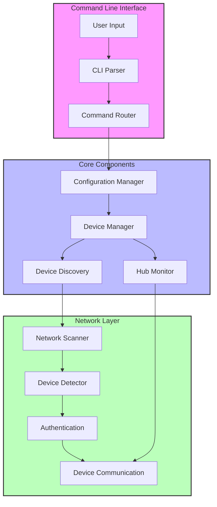
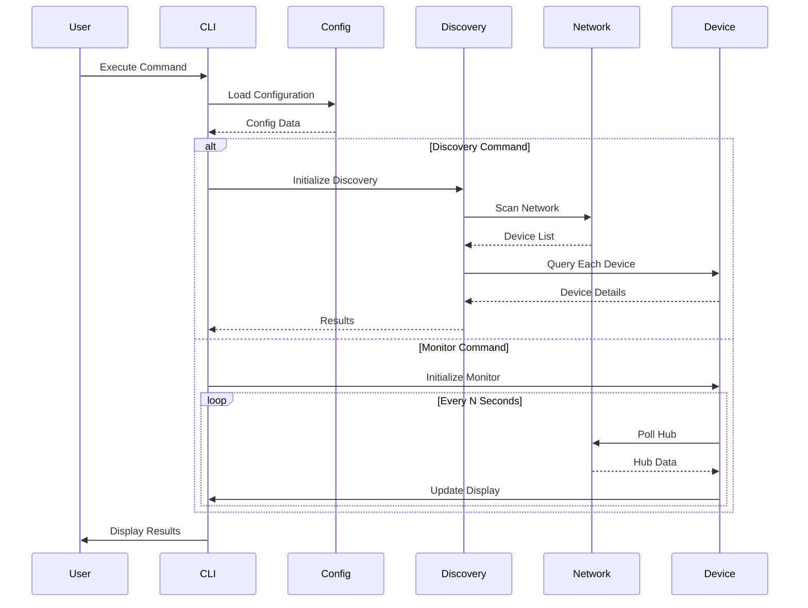
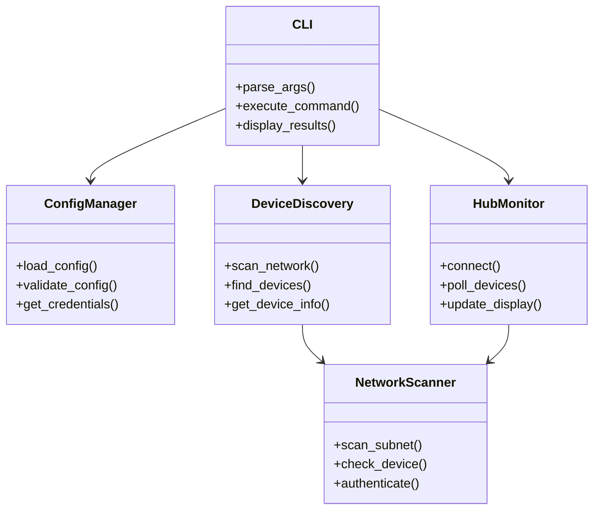

# Tapo Chatter

A comprehensive Python application for managing, monitoring, and discovering TP-Link Tapo smart home devices, with special focus on the H100 Hub ecosystem and its connected child devices.

## Quick Start

```bash
# Install the package
pip install git+https://github.com/CaptainCodeAU/tapo_chatter.git

# Set up your configuration in ~/.config/tapo_chatter/.env
# Then run:
tapo-chatter --help
```

## Project Overview

### System Architecture

The application is built with a modular architecture focusing on:

-   **Core Components**: CLI, Configuration Management, Device Discovery, Hub Monitoring
-   **Data Processing**: Device Data Processing, Network Scanning, Device Detection
-   **User Interface**: Command Line Interface, Rich Console Output



### Code Structure

```
tapo_chatter/
├── src/
│   └── tapo_chatter/
│       ├── __init__.py        # Package initialization
│       ├── cli.py            # Command-line interface
│       ├── config.py         # Configuration management
│       ├── device_discovery.py # Device discovery logic
│       ├── discover.py       # Network discovery implementation
│       ├── main.py          # Core application logic
│       └── utils.py         # Utility functions
├── docs/
│   ├── ARCHITECTURE.md      # System architecture details
│   ├── TECHNICAL_OVERVIEW.md # Technical implementation details
│   ├── DESIGN.md           # Design decisions and patterns
│   └── images/             # Architectural and flow diagrams
├── tests/                  # Test suite
└── scripts/               # Development and maintenance scripts
```

### Data Flow



### Component Interaction



## Features

### Unified Command Line Interface (v0.3.0+)

Tapo Chatter now provides a unified command line interface with subcommands:

-   🔄 **Single Command:** Access all functionality through the `tapo-chatter` command with different subcommands
-   📋 **Backward Compatible:** Original `tapo-monitor` and `tapo-discover` commands are still supported
-   ⚙️ **Customizable:** More configuration options available through command line flags

### Tapo Hub Monitor (`tapo-chatter monitor`)

-   🔍 Discovers and lists all child devices connected to your H100 hub.
-   📊 Displays device information across two detailed tables:
    -   **Additional Device Information Table:**
        -   Device Name
        -   Hardware Version (HW Ver)
        -   MAC Address
        -   Region
        -   Signal Level
        -   Battery Status (OK/Low)
        -   Jamming RSSI (Color-coded: Green for good, Yellow for fair, Red for poor)
        -   Report Interval (s)
        -   Last Onboarded Timestamp
    -   **Main Device Status Table:**
        -   Device Name
        -   Device ID
        -   Device Type
        -   Online/Offline Status
        -   RSSI (Received Signal Strength Indicator, color-coded: Green for good, Yellow for fair, Red for poor)
        -   Details: Sensor-specific status (e.g., "Motion: Clear", "Contact: Closed").
            -   Critical states like "Motion: Detected" and "Contact: Open" are highlighted in bold red.
            -   Temperature and Humidity levels are shown here for compatible sensors (e.g., T31x).
-   🚦 Network connectivity checking to the hub.
-   🔐 Secure authentication handling (credentials are not displayed in logs or console during normal operation).
-   📊 Enhanced error reporting and more robust device data parsing.
-   🔄 **Real-time Monitoring:** Continuously polls the hub at a set interval (default: 10 seconds) and refreshes the device display, allowing you to see live status changes, including devices going offline.
-   📝 Debugging information available through code modification if deeper inspection is needed.

### Network Device Discovery Tool (`tapo-chatter discover`)

-   🔎 **Auto Network Detection:** Automatically identifies your local network subnet.
-   ⚡ **Parallel Scanning:** Concurrently probes multiple IP addresses for faster discovery.
-   🚀 **Optimized for Speed:** Higher default concurrency (20) and lower timeout (0.5s) for faster scanning.
-   🎯 **Early Stopping:** Ability to stop scanning after finding a specific number of devices.
-   🎚️ **Configurable Scanning:** Customize subnet, IP range, concurrency limit, and timeout.
-   📋 **Detailed Device Information:** Displays comprehensive information about discovered devices, including:
    -   IP Address
    -   Device Name
    -   Model
    -   Type
    -   Connection Status (Online/Offline) or Power State (On/Off) depending on device type
    -   Signal Level (Color-coded)
    -   MAC Address
-   🔄 **Hub Child Device Detection:** Automatically detects Tapo Hubs and shows all connected child devices with detailed status information
-   🔁 **Thread Management:** Uses semaphores to limit concurrent connections, preventing network overload.
-   📊 **JSON Output Option:** Export discovery results in JSON format for further processing.
-   🔍 **Improved Error Handling:** Verbose mode now provides a structured summary of connection errors by type instead of raw error messages.
-   📝 **Scan Statistics:** Shows comprehensive scan information including IPs scanned and error count.

## Supported Devices

The application can detect and display information for various Tapo devices on your network, including:

-   H100 Hub and all connected child devices
-   T110 Contact Sensors
-   KE100 Radiator Controllers (TRV)
-   T100 Motion Sensors
-   S200B Smart Buttons
-   T300 Water Leak Sensors
-   T31x Temperature/Humidity Sensors
-   P100/P110 Smart Plugs
-   L510/L530 Smart Bulbs
-   And other compatible Tapo smart home devices

## Prerequisites

-   Python 3.13+ installed.
-   [`uv`](https://github.com/astral-sh/uv) package manager
-   [`direnv`](https://direnv.net/) (recommended for environment management)
-   A Tapo account
-   A Tapo H100 Hub or other Tapo devices on your local network

## Installation

1. **Clone the Repository:**

    ```bash
    git clone <repository_url>
    cd tapo_chatter
    ```

2. **Set up Python Environment:**

    ```bash
    # Install uv if you haven't already
    curl -LsSf https://astral.sh/uv/install.sh | sh

    # Create and activate virtual environment
    python_setup 3.13
    ```

3. **Configure Environment Variables:**
   The application requires your Tapo username (email), password, and the IP address of your H100 hub.
   These can be configured in several ways, with the following order of precedence (highest first):

    1. **Shell Environment Variables:** Export `TAPO_USERNAME`, `TAPO_PASSWORD`, and `TAPO_IP_ADDRESS` in your shell.
    2. **User-Specific `.env` File:** Create a file named `.env` in the application\'s user-specific configuration directory. This is the recommended way for `pipx` users or for a global setup.
        - **Linux/macOS:** `~/.config/tapo_chatter/.env`
        - **Windows:** Typically `C:\Users\<YourUser>\AppData\Roaming\tapo_chatter\Config\.env` (The application will create the `tapo_chatter` directory if it doesn\'t exist; you just need to create the `.env` file inside it).
          You can find the exact path for your system if the application fails to find the configuration variables as it will be printed in the error message.
    3. **Local Project `.env` File:** Create a file named `.env` in your project's root directory (or any parent directory from where you run the command if not installed).

    **Example `.env` file content:**

    ```.env
    # Required Authentication (always required)
    TAPO_USERNAME="your_tapo_email@example.com"
    TAPO_PASSWORD="your_tapo_password"

    # Single Device Mode Configuration
    # Required when using monitor-one or probe-one modes
    # Example: Your H100 Hub's IP address
    TAPO_IP_ADDRESS="192.168.1.100"

    # Multi-Device Mode Configuration
    # Required when using monitor-all or probe-all modes
    # You can specify IP ranges in several formats:
    # - Single IP: "192.168.1.100"
    # - IP range: "192.168.1.100-192.168.1.110"
    # - CIDR notation: "192.168.1.0/24"
    # - Comma-separated combination: "192.168.1.100,192.168.1.200-192.168.1.210,192.168.1.0/24"
    TAPO_IP_RANGE="192.168.1.1-192.168.1.254"

    # Note: You can include both TAPO_IP_ADDRESS and TAPO_IP_RANGE in your .env file
    # The application will use the appropriate one based on the selected operation mode:
    # - monitor-one, probe-one: uses TAPO_IP_ADDRESS
    # - monitor-all, probe-all: uses TAPO_IP_RANGE
    ```

    **Note on Configuration for `pipx` users:**
    After installing with `pipx`, `tapo-chatter` will be available globally. To configure credentials, it is recommended to create a `.env` file in the directory from which you run the `tapo-chatter` command (or any parent directory).

**4. Installing the Package:**

You have a few options to install and use `tapo-chatter`:

-   **For Development (Editable Install):**
    If you plan to modify the code, it's best to do an editable install from your local clone. This way, changes to the source code are immediately reflected.
    Navigate to the project's root directory:

    ```bash
    # Using pip
    pip install -e .

    # Or using uv
    # uv pip install -e .
    ```

-   **Standard Local Install:**
    To install the package as it is from your local clone (changes won't reflect without re-installation):
    Navigate to the project's root directory:

    ```bash
    # Using pip
    pip install .

    # Or using uv
    # uv pip install .
    ```

*   **Installing with `pipx` (Recommended for CLI tools):**
    `pipx` installs Python applications into isolated environments, which is great for CLI tools.
    First, ensure you have `pipx` installed (see [pipx installation guide](https://pypa.github.io/pipx/installation/)).

    Then, you can install `tapo-chatter` directly from GitHub:

    ```bash
    pipx install git+https://github.com/CaptainCodeAU/tapo_chatter.git
    ```

    **Note on Configuration for `pipx` users:**
    After installing with `pipx`, `tapo-chatter` will be available globally. You'll need to ensure the required environment variables (`TAPO_USERNAME`, `TAPO_PASSWORD`, `TAPO_IP_ADDRESS`) are set. You can do this by:

    1.  Creating a `.env` file in the directory from which you run the `tapo-chatter` command (or any parent directory).
    2.  Setting these as system environment variables in your shell (e.g., in your `.bashrc` or `.zshrc`).

## Usage

### Unified Command Line Interface (v0.3.0+)

Starting with version 0.3.0, Tapo Chatter provides a unified command line interface:

```bash
# Show help for the unified command
tapo-chatter --help

# Show version information
tapo-chatter --version
```

#### Hub Monitor Mode

```bash
# Monitor a hub using TAPO_IP_ADDRESS from environment variables
tapo-chatter monitor

# Monitor a specific hub IP address (overrides TAPO_IP_ADDRESS)
tapo-chatter monitor --ip 192.168.1.100

# Adjust the refresh interval (in seconds)
tapo-chatter monitor --interval 5
```

#### Device Discovery Mode

```bash
# Discover devices on your network
# - If no options provided, uses TAPO_IP_RANGE from .env if set
# - If TAPO_IP_RANGE not set, auto-detects subnet and scans 1-254
tapo-chatter discover

# Specify subnet to scan (overrides subnet from TAPO_IP_RANGE)
tapo-chatter discover -s 192.168.1

# Specify IP range (overrides range from TAPO_IP_RANGE)
tapo-chatter discover -r 1-10

# Use both subnet and range (completely overrides TAPO_IP_RANGE)
tapo-chatter discover -s 192.168.1 -r 1-10

# Adjust concurrency and timeout for faster scanning
tapo-chatter discover -l 30 -t 0.3

# Stop scanning after finding a specific number of devices
tapo-chatter discover -n 5

# Output results in JSON format
tapo-chatter discover -j

# Enable cleaner error summary report
tapo-chatter discover -v

# Skip fetching child devices from discovered hubs
tapo-chatter discover --no-children
```

### Legacy Commands (Backward Compatible)

The original commands are still supported for backward compatibility:

#### H100 Hub Monitor (Legacy)

```bash
# Run the original monitor command (uses TAPO_IP_ADDRESS from .env)
tapo-monitor

# Monitor a specific IP address
tapo-monitor --ip 192.168.1.100
```

#### Device Discovery Tool (Legacy)

```bash
# Run the original discover command (uses TAPO_IP_RANGE from .env if set)
tapo-discover

# With options (supports all new IP range formats)
tapo-discover --subnet 192.168.0 --range "192.168.0.100-192.168.0.110"
tapo-discover --subnet 192.168.0 --range "192.168.0.0/24"
```

## Troubleshooting

If you encounter issues:

1. **Connectivity Problems:**

    - Verify you're on the same network as your Tapo devices
    - Check if your firewall is blocking connections
    - Confirm the IP address of your hub is correct

2. **Authentication Issues:**

    - Check your Tapo username and password
    - Verify you're using the email address associated with your Tapo account

3. **Device Not Showing:**
    - Ensure the device is powered on and connected to your network
    - Try rebooting the device
    - Check if the device is visible in the official Tapo app

## Contributing

Contributions are welcome! Please feel free to submit a Pull Request.

## License

This project is licensed under the MIT License - see the LICENSE file for details.

## Acknowledgments

-   Built using the [Tapo Python Library](https://github.com/mihai-dinculescu/tapo)
-   Thanks to the TP-Link Tapo team for their smart home devices

## Version History

### v0.3.0 (Latest)

-   Added support for flexible IP range configuration via TAPO_IP_RANGE environment variable
-   Added support for multiple IP range formats (single IP, range, CIDR, comma-separated)
-   Improved device discovery with configurable IP ranges
-   Enhanced documentation with detailed configuration examples
-   Introduced unified command line interface with subcommands
-   Added backward compatibility for legacy commands
-   Improved configuration options through command line flags
-   Enhanced error handling and reporting

### v0.2.0

-   Added support for H100 Hub child device monitoring
-   Improved device discovery with parallel scanning
-   Added JSON output option for discovery results
-   Enhanced error handling with structured summaries

### v0.1.0

-   Initial release
-   Basic device discovery functionality
-   Simple hub monitoring capabilities

## Documentation

The project includes comprehensive technical documentation in the `docs/` directory:

### Architecture Documentation (`ARCHITECTURE.md`)

A detailed system architecture document that covers:

-   Core system components and their interactions
-   Data flow through the system
-   Key abstractions and dependencies
-   Security considerations
-   Error handling strategies
-   Performance optimizations
-   Future extensibility plans

### Technical Overview (`TECHNICAL_OVERVIEW.md`)

A comprehensive technical guide covering:

-   Complete technology stack details
-   Code organization and structure
-   Implementation details for each component
-   Data structures and their usage
-   Error handling mechanisms
-   Performance optimization strategies
-   Testing approach
-   Deployment considerations

### Design Documentation (`DESIGN.md`)

A detailed design document that outlines:

-   Core design philosophy and principles
-   Design patterns used in the project
-   Component-level design decisions
-   Interface design specifications
-   Data model design
-   Error handling design
-   Security design considerations
-   Performance design strategies
-   Future design considerations

### Development Workflow

1. **Setup & Configuration**

    - Clone repository
    - Install dependencies
    - Configure environment

2. **Development Cycle**

    - Write code
    - Run tests
    - Update documentation
    - Submit changes

3. **Testing & Validation**
    - Unit tests
    - Integration tests
    - Manual testing
    - Documentation review
