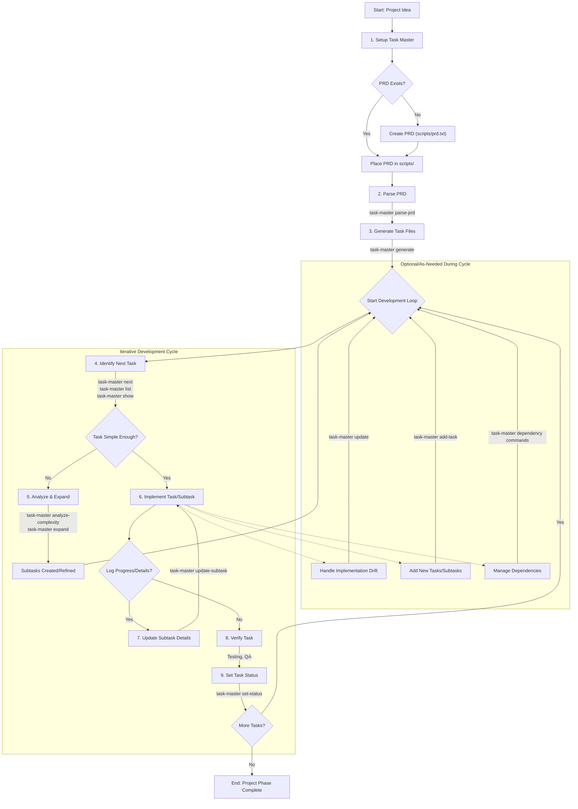

# Task Master Cheatsheet & Workflow

This document provides a quick reference for Task Master commands and illustrates a typical development workflow.

## 1. Initial Setup & Configuration

### Installation

Install Task Master globally using npm:

```bash
npm i -g task-master-ai
```

### Project Initialization

Navigate to your project directory and initialize Task Master:

```bash
task-master init
```

This will prompt you for project details and set up the necessary files and structure.

### AI Model Configuration

View and configure the AI models Task Master will use. Configuration is stored in `.taskmasterconfig` in your project root. API keys are managed via `.env` (for CLI) or MCP configuration (e.g., `mcp.json` for Cursor).

**View current model configuration and API key status:**

```bash
task-master models
```

**Set specific models (provider is inferred if known):**

```bash
# Set the primary model for generation/updates
task-master models --set-main=claude-3-opus-20240229

# Set the research model
task-master models --set-research=sonar-pro

# Set the fallback model
task-master models --set-fallback=claude-3-haiku-20240307
```

**Set custom models:**

```bash
# Set a custom Ollama model for the main role
task-master models --set-main=my-local-llama --ollama

# Set a custom OpenRouter model for the research role
task-master models --set-research=google/gemini-pro --openrouter
```

**Run interactive setup for guided configuration:**

```bash
task-master models --setup
```

**Important:** Ensure API keys for selected AI providers are present in your `.env` file (for CLI use) or MCP configuration (for editor/AI agent use).

### MCP (Model Control Protocol) Setup (Recommended for AI Agent/Editor Integration)

For editors like Cursor, configure the MCP server to allow the AI agent to interact with Task Master seamlessly.
Refer to the "Task Master Tutorial" for details on setting up the `mcp.json` (or equivalent) with the command `npx -y --package=task-master-ai task-master-ai` and your API keys.

## 2. Core Workflow Commands

### PRD Processing & Initial Task Generation

**Place your Product Requirements Document (PRD) in `scripts/prd.txt` (or other chosen location).**

**Parse PRD and generate `tasks.json`:**

```bash
# Default: Tries to generate a reasonable number of tasks
task-master parse-prd scripts/prd.txt

# Specify approximate number of top-level tasks
task-master parse-prd scripts/prd.txt --num-tasks=15

# Force overwrite if tasks.json already exists
task-master parse-prd scripts/prd.txt --force
```

**Generate individual task files (e.g., `task_001.md`) from `tasks.json`:**

```bash
task-master generate
```

### Task Listing & Viewing

**List all tasks:**

```bash
task-master list
```

**Filter tasks by status:**

```bash
task-master list --status=pending
```

**Include subtasks in the list:**

```bash
task-master list --with-subtasks
```

**Show the next recommended task to work on (based on dependencies and priority):**

```bash
task-master next
```

**Show details for a specific task or subtask:**

```bash
# Show task by ID
task-master show 15
task-master show --id=15

# Show subtask (e.g., subtask 2 of parent task 15)
task-master show 15.2
```

### Task Creation & Modification (Ongoing)

**Add a new task using AI:**

```bash
task-master add-task --prompt="Implement user authentication module"
```

_Optional flags:_
`--dependencies=1,2`
`--priority=high`
`--research` (to use the research AI model)

**Update multiple upcoming tasks based on new context (starting from a specific ID):**

```bash
task-master update --from=4 --prompt="Switch database from PostgreSQL to MongoDB"
```

_Optional flags:_
`--research`

**Update a single specific task by ID:**

```bash
task-master update-task --id=3 --prompt="Refine error handling for API endpoints"
```

_Optional flags:_
`--research`

**Append timestamped information/notes to a specific subtask (does not overwrite existing details):**

```bash
task-master update-subtask --id=3.1 --prompt="Confirmed API key rotation mechanism is needed."
```

_Optional flags:_
`--research`

### Task Status Management

**Set the status of one or more tasks/subtasks:**

```bash
# Single task
task-master set-status --id=5 --status=done

# Multiple tasks
task-master set-status --id=6,7 --status=in-progress

# Subtask
task-master set-status --id=5.1 --status=pending
```

(Common statuses: `pending`, `in-progress`, `done`, `deferred`, `cancelled`, `review`)
_Note: Marking a parent task "done" will also mark its subtasks "done"._

### Task Structuring & Breakdown (Expansion)

**Analyze task complexity (AI-driven, creates `scripts/task-complexity-report.json`):**

```bash
task-master analyze-complexity
```

_Optional flags:_
`--output=my-report.json`
`--threshold=7` (score 1-10 for expansion recommendation)
`--research`

**View the complexity report in a readable format:**

```bash
task-master complexity-report
```

_Optional flags:_
`--file=my-report.json`

**Expand a complex task into subtasks (uses complexity report if available):**

```bash
# Specify number of subtasks
task-master expand --id=5 --num=3

# Provide additional context for generation
task-master expand --id=5 --prompt="Focus on user interface aspects"

# Use research model for generation
task-master expand --id=5 --research

# Force overwrite if subtasks exist
task-master expand --id=5 --force
```

**Expand all pending tasks (uses complexity report if available):**

```bash
task-master expand --all
```

_Optional flags:_
`--num=3` (default subtasks per task if no complexity data)
`--prompt="General guidelines for subtasks"`
`--research`
`--force`

**Clear subtasks from one or more parent tasks:**

```bash
# Specific task
task-master clear-subtasks --id=5

# Multiple tasks
task-master clear-subtasks --id=5,6

# All tasks
task-master clear-subtasks --all
```

### Dependency Management

**Add a dependency (task 5 depends on task 3):**

```bash
task-master add-dependency --id=5 --depends-on=3
```

**Remove a dependency:**

```bash
task-master remove-dependency --id=5 --depends-on=3
```

**Validate dependency integrity (check for circular/missing dependencies):**

```bash
task-master validate-dependencies
```

**Automatically fix identified dependency issues:**

```bash
task-master fix-dependencies
```

## 3. Task Master Process Flow Diagram

This diagram illustrates a common workflow using Task Master.



This cheatsheet should help you effectively use Task Master for your projects. Remember to consult the official documentation or use `task-master <command> --help` for more detailed information on specific commands.
